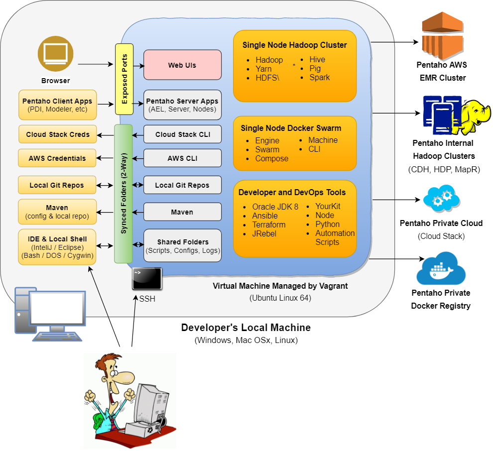

# Pentaho Hadoop Development Environment

Whoa!  There's a lot going on in that picture.  Let's break it down.

First of all, that guy is way too excited.  But I can see why.  His coding life just got easier.

He just cloned this repo, ran "vagrant up", and got a complete development environment with all those tools.  For free.  And it's all set up already.  And it "just works".  Here's what he got:
* An **Ubuntu Linux** virtual machine running on his laptop.
* A working **Apache hadoop cluster** with usual suspects set up and running:  hdfs, yarn, hive, spark.
* **Docker Swarm Node**, so he can deploy apps onto his laptop super easy and test his own apps in containers. 
* **Folders are synced** between his desktop and VM.  So he can switch back and forth.  Develop in his favorite Windows IDE.  Test against hadoop cluster in his VM.  No copying or SCPing files.
* **Maven and git are synced**.  Maven in his VM will use same config file and local repo as desktop. 
* **CLI tools** to access and **deploy** apps easily to **cloud providers**, like AWS, Google Cloud, and our own internal Cloud Stack.
* **Automation Scripts** to make using, developing, and testing Pentaho apps easier.  Scripts to:
  - Download and install latest QAT and snapshot versions of Pentaho Builds
  - Configure hadoop shims, AEL, server, and others
  - Copy code changes and updated .jars to install, clearing karaf caches if needed.
* **Ports are exposed** from VM to his desktop.  So, accessing *8Web UIs** running in his VM is easy as typing "http://localhost<port-number>" into his browsewr
  - (Spark History Server, Yarn Resource Manager, Pentaho Server, etc)
* _*AND on top of all that*_ he's running **[JRebel](https://zeroturnaround.com/software/jrebel/)**.  